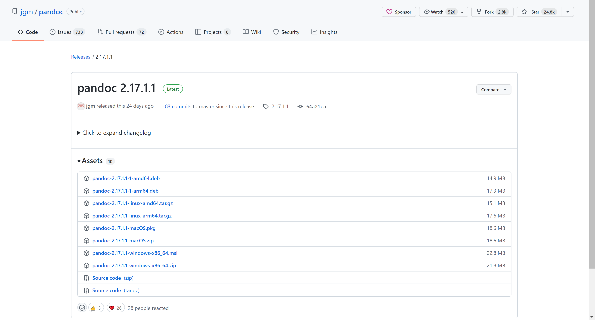
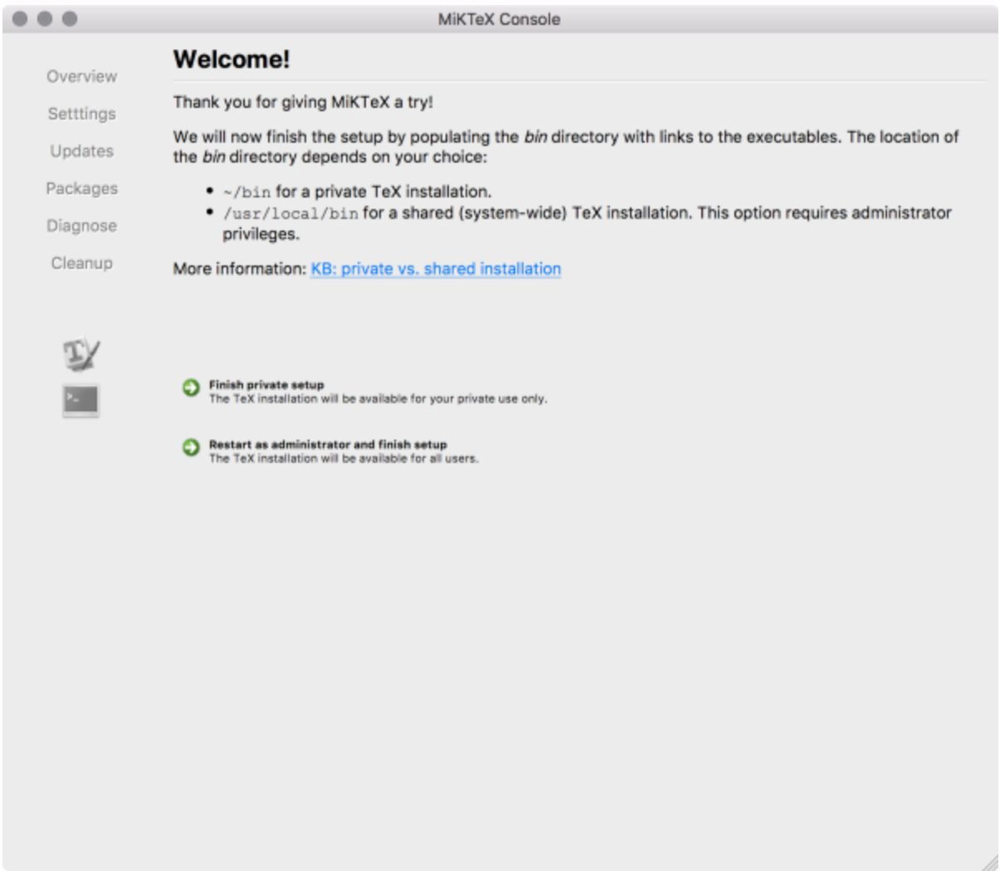

# How to Download and Install Pandoc on macOS

This task includes instructions on how to download and install *Pandoc* for *macOS* users. There are also optional instructions for installing *MiKTeX*.

## Requirements

- Computer
- macOS Operating System
- Internet Access

## Steps to Install Pandoc

1. [Go to this webpage.](<https://github.com/jgm/pandoc/releases/latest>)

    > Note: The webpage should look like this.

    

2. Download the *pandoc-X.XX.X.X-macOS.pkg* file by clicking on the file name. This is the installer file.

    > Note: X.XX.X.X refers to the version number. It is 2.17.1.1 in the image above.

3. Run the installer by double-clicking on the downloaded file.

    > Note: A new window should pop up. This is what it should look like.

    

4. Press *Continue* to continue.

5. Follow the directions given by the *Installer* to complete your installation.

    > Note: This program automatically installs *Pandoc* for you.

6. Lastly, to check if *Pandoc* was installed, type "**pandoc -v**" in your terminal. If *Pandoc* was installed correctly, you should see that the next line in the terminal is: "**pandoc.exe X.XX.X.X**" where the X's represent the version number. If an error occurs, return to step 1 and try again.

    > Note: You can access the terminal on a Mac by opening the Launchpad, typing Terminal in the search field, and clicking Terminal.

## Optional Steps to install MiKTeX (recommended)

1. [Go to this webpage.](<https://miktex.org/download>)

    > Note: The webpage should look like this.

    

2. Select the *Mac* tab.

3. Press the *Download* button to download the disk image (.dmg) file.

4. Double-click on the downloaded disk image (.dmg) file.

    > Note: A new window should pop up. This is what it should look like.

    

5. Drag the *MiKTeX* icon onto the *Applications* folder icon.

    > Note: This will install the *MiKTeX Console* application and all required files.

6. Run the *MiKTeX Console* application from *Launchpad*.

    > Note: A new window should pop up. This is what it should look like.

    

7. Select the *Finish private setup* option.

8. *MiKTeX* has been installed!


