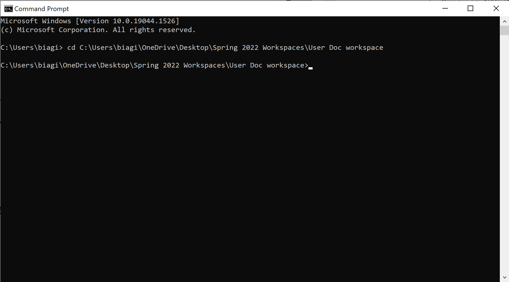

# How to convert Markdown files to Word using Pandoc

This task includes instructions on how to convert *Markdown* files to *Word* using *Pandoc*.

## Requirements

- *Markdown* (.md) file

- *Pandoc*

## Steps

1. Locate your *Markdown* (.md) file you want to convert to *Word*.

2. Find the path to the folder which contains your *Markdown* file. (See the images below for reference)

    - On Windows, this can be done by right-clicking the *Word* file and selecting *Properties*. The path will be next to Location.

    - On macOS, this can be done by right-clicking the *Word* file and selecting *Get Info*. The path will be next to Where.

    
    

3. Open Terminal.

    - On *Windows*, You can access the *Windows PowerShell* terminal with Windows key + X. Select *Windows PowerShell* from the menu that pops up.

    - On *macOS*, you can access the terminal by opening the *Launchpad*, typing Terminal in the search field, and clicking *Terminal*.

4. Change directory to the folder which contains your Markdown file.

    > Note: Use command "**cd**" to change directory within the Terminal. See the example below for help with the command.

    

5. Use the following command:

    > **pandoc -s test.md -f markdown -t docx -o
    test1.docx**

    - **-s** identifies the source file name.
    - **-f** identifies the source format.
    - **-t** identifies the target format.
    - **-o** identifies the output file name.

6. You should now see the newly created *Word* (.docx) file in the same folder.


