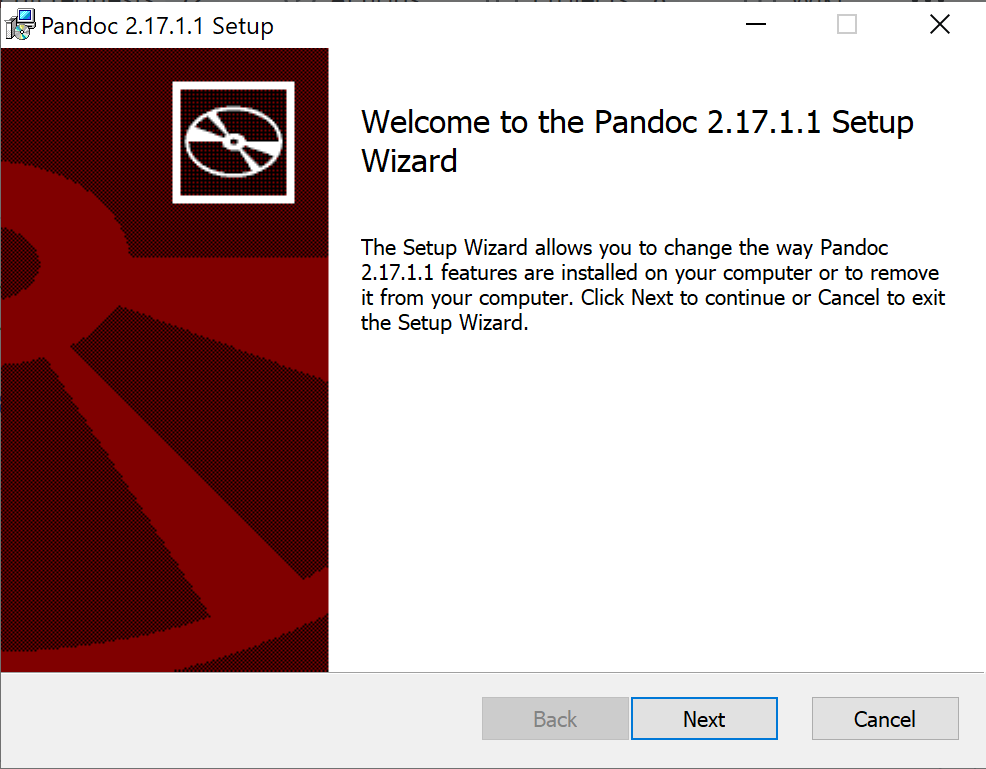
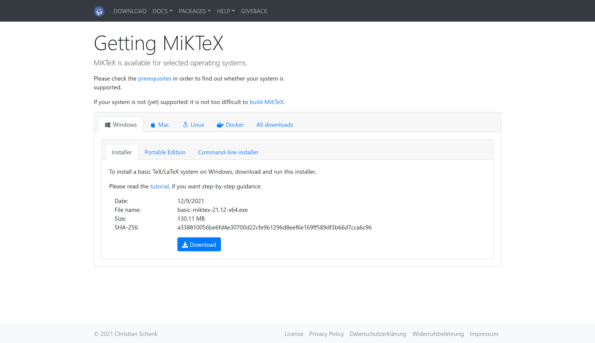
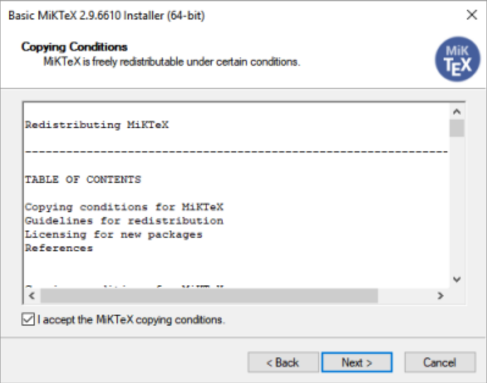
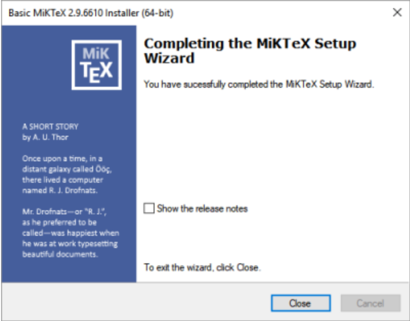

# How to Download and Install Pandoc on Windows

This task includes instructions on how to download and install *Pandoc* for *Windows* users. There are also optional instructions for installing *MiKTeX*.

## Requirements

- Computer
- Windows Operating System
- Internet Access

## Steps to Install Pandoc

1. [Go to this webpage.](<https://github.com/jgm/pandoc/releases/latest>)

    > Note: The webpage should look like this.

    

2. Download the *pandoc-X.XX.X.X-windows-x86.msi* file by clicking on the file name. This is the installer file.

    > Note: X.XX.X.X refers to the version number. It is 2.17.1.1 in the image above.

3. Run the installer by double-clicking on the downloaded file.

    > Note: A new window should pop up. This is what it should look like.

    

4. Press *Next* to continue.

5. Follow the directions given by the *Setup Wizard* to complete your installation.

    > Note: This program automatically installs *Pandoc* for you.

6. Lastly, to check if *Pandoc* was installed, type “**pandoc -v**” in your terminal. If Pandoc was installed correctly, you should see that the next line in the terminal is: “**pandoc.exe X.XX.X.X**” where the X’s represent the version number. If an error occurs, return to step 1 and try again.
    > Note: You can access the *Windows PowerShell* terminal with Windows key + X. Select *Windows PowerShell* from the menu that pops up. (See image below for reference).

    

## Optional Steps to install MiKTeX (recommended)

1. [Go to this webpage.](<https://miktex.org/download>)

    > Note: The webpage should look like this.

    

2. Under the *Windows* tab, select the *Installer* tab.

3. Press the *Download* button to download the installer.

4. Run the installer by double-clicking on the downloaded file.

    > Note: A new window should pop up. This is what it should look like.

    

5. Read the conditions and check the "I accept the *MiKTeX* copying conditions." option.

6. Press *Next* to continue.

7. Follow the instructions in the installer to complete the
    installation.

8. Once you have reached this page in the installer, you are done. *MiKTeX* has been installed!

    


