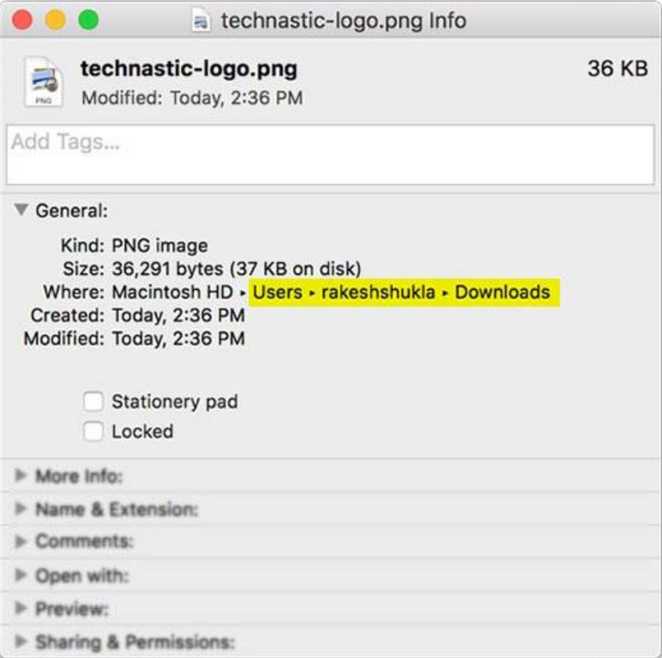
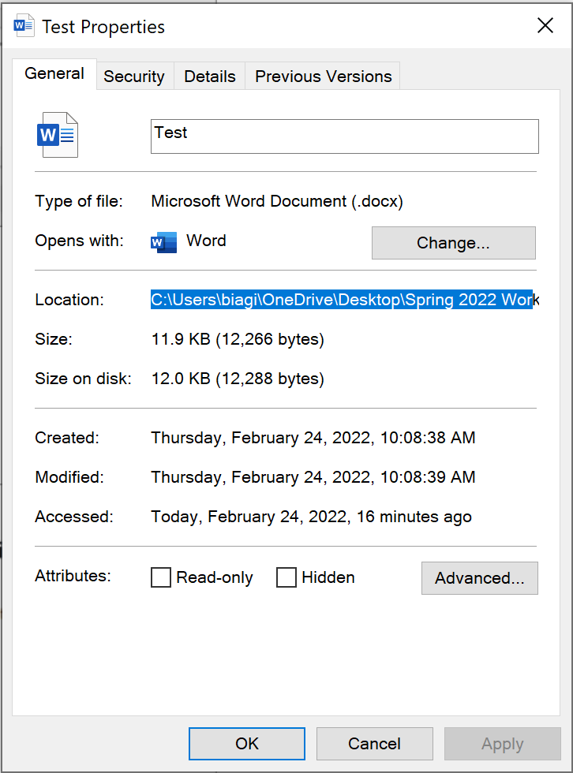
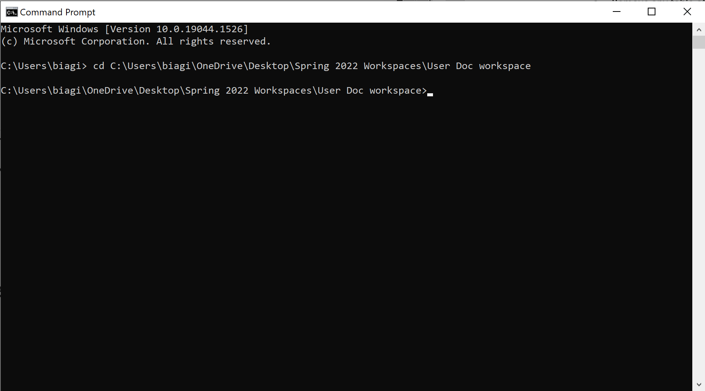

# How to convert Word files to Markdown using Pandoc

This task includes instructions on how to convert *Word* files to *Markdown* files using *Pandoc*.

## Requirements

- *Word* (.docx) file
- *Pandoc*

## Steps

1. Format your *Word* file.

    - Remove any table of contents or title pages. Only keep the core of the text material (headings, paragraphs, etc.)

2. Locate your *Word* (.docx) file you want to convert to *Markdown*.

3. Find the path to the folder which contains your *Word* file.(See the images below for reference)

    - On Windows, this can be done by right-clicking the *Word* file and selecting *Properties*. The path will be next to Location.

    - On macOS, this can be done by right-clicking the *Word* file and selecting *Get Info*. The path will be next to Where.

    
    

4. Open Terminal.

    - On *Windows*, You can access the *Windows PowerShell* terminal with Windows key + X. Select *Windows PowerShell* from the menu that pops up.

    - On *macOS*, you can access the terminal by opening the *Launchpad*, typing Terminal in the search field, and clicking *Terminal*.

5. Change directory to the folder which contains your Word file.

    > Note: Use command "**cd**" to change directory within the Terminal. See the example below for help with the command.

    

6. Use the following command:

    > **pandoc -s file.docx -t markdown --extract-media=images -o file.md**

    - **-s** identifies the source file name.
    - **-t** identifies the target format.
    - **--extract-media** will create an images subfolder to store any images contained in the file.
    - **-o** identifies the output file name.

7. Now, you should have a markdown file by the same name within your folder. From here, you must correct the automated formatting. Fix empty headings, correct heading order, etc.

    > Note: Pandoc is not perfect, so there may be some errors in the formatting of the markdown document.

8. Once you are done correcting the formatting, you are finished! You have now successfully converted a *Word* file to a *Markdown* file using *Pandoc*!


